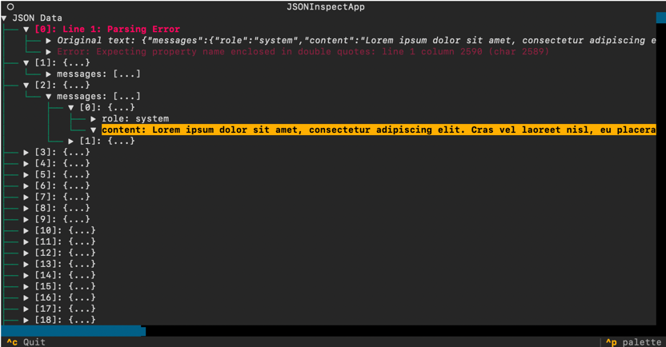
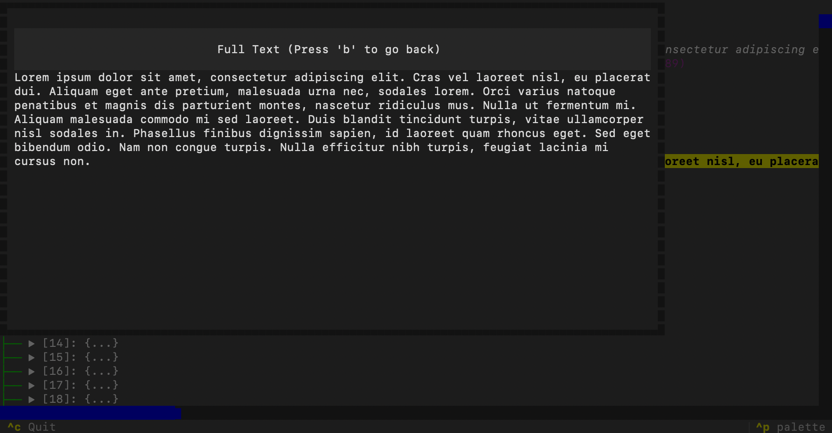

# jsonl_visualize

jsonl_visualize is a versatile application that allows you to visually inspect and navigate JSON and JSONL (JSON Lines) data. It provides both a Terminal User Interface (TUI) and a Web-based User Interface for interactive exploration of JSON structures, handles parsing errors gracefully, and allows for easy exploration of large JSON datasets.

With JSONL error handling:


With modal view for large strings:


## Installation

```
pip install jsonl_visualize
```

## Features

- Interactive tree view of JSON and JSONL data in both TUI and Web UI
- Supports both single JSON objects and JSONL (multiple JSON objects, one per line)
- Graceful handling of parsing errors, displaying them inline with successfully parsed data
- Expandable error nodes showing original unparsable text and error messages
- Truncation of long text values with the ability to view full text in a modal
- Keyboard navigation for easy exploration of the JSON structure in TUI mode
- Web-based interface for a more familiar and accessible visualization

## Usage

You can use jsonl_visualize in three ways:

1. With a JSON or JSONL file using the TUI:
   ```
   jsonl_visualize path/to/your/file.json
   ```

2. With piped input using the TUI:
   ```
   cat path/to/your/file.json | jsonl_visualize
   ```

3. With the Web UI option:
   ```
   jsonl_visualize --webui path/to/your/file.json
   ```
   or
   ```
   cat path/to/your/file.json | jsonl_visualize --webui
   ```

### TUI Keyboard Controls

- Arrow keys: Navigate the tree
- Enter: Expand/collapse nodes or view full text of truncated values
- 'q' or Ctrl+C: Quit the application
- 'b' or Escape: Go back from full text view to main tree view

### Web UI

The Web UI provides a familiar interface with collapsible tree nodes and expandable long text values. It opens in your default web browser, allowing for easy navigation and exploration of your JSON/JSONL data.

## Error Handling

When jsonl_visualize encounters a parsing error in a JSONL file, it will:

1. Display the error in red at the appropriate position in the tree.
2. Show the line number where the error occurred.
3. Allow you to expand the error node to see:
   - The original unparsable text
   - The specific error message

This allows you to inspect and debug issues in your JSON data easily.

## Installation (development)

1. Ensure you have Python 3.7 or higher installed on your system.

2. Clone this repository:
   ```
   git clone https://github.com/gr-b/jsonl_visualize.git
   cd jsonl_visualize
   ```

3. Install the required dependencies:
   ```
   pip install -e .
   ```

## Limitations

- The application loads the entire JSON/JSONL file into memory, so it may not be suitable for extremely large files.
- Syntax highlighting is not provided for the JSON structure in the TUI to maintain simplicity and performance.

## License

This project is licensed under the MIT License - see the LICENSE file for details.